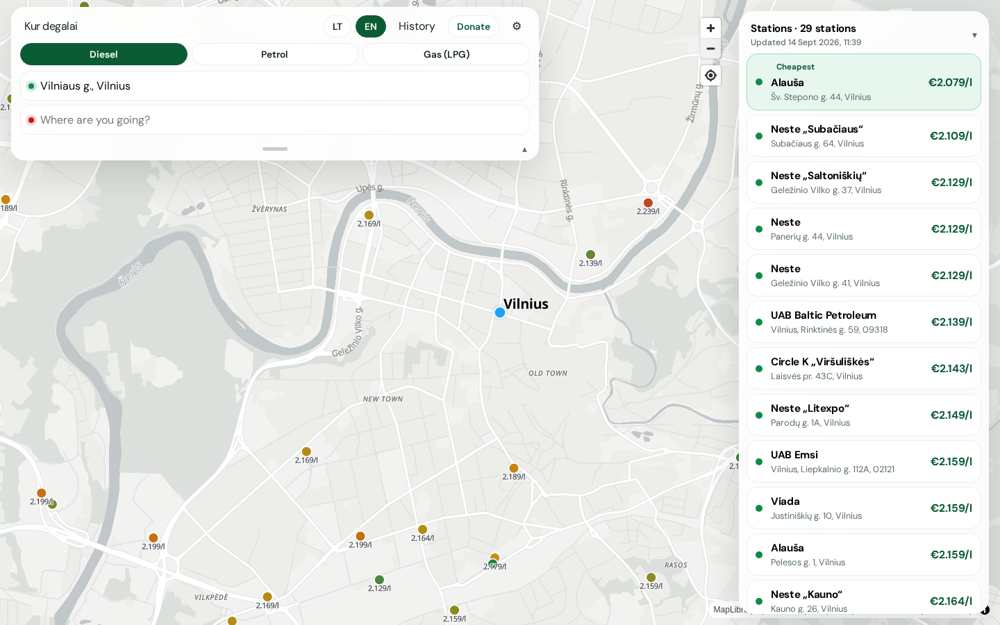
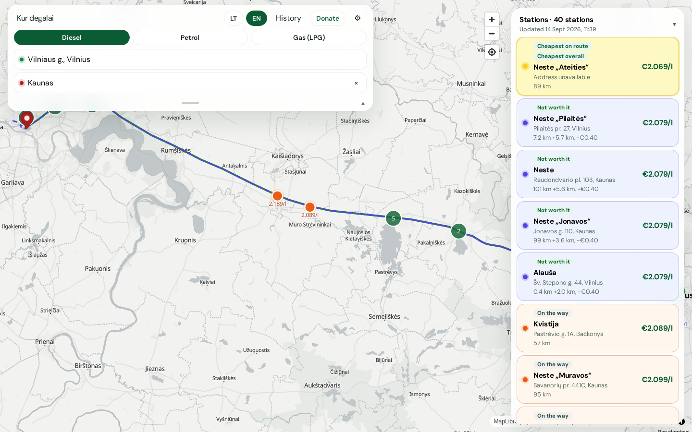
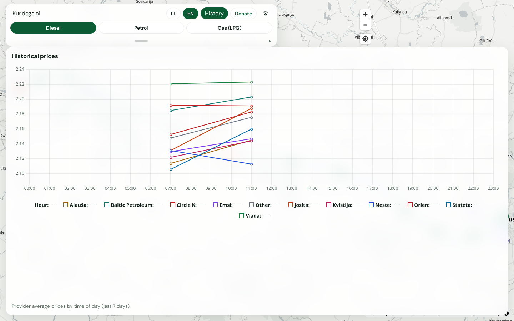
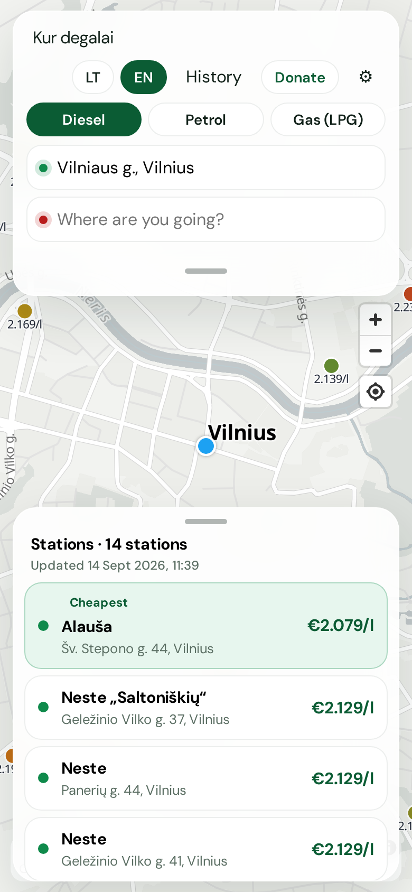

# Kur degalai

Free, up-to-date fuel prices at every station in Lithuania. Open the map, pick
diesel, petrol, or LPG, and see who is cheapest nearby or on the way.

**[Open the app](https://almantask.github.io/Degalai-web/)** · Lithuanian is the
default (`/`) · [English](https://almantask.github.io/Degalai-web/en/)

It is a static PWA: no account, no backend. Prices come from the Lithuanian
Energy Agency; station locations come from OpenStreetMap.

## Screenshots

Map of stations, coloured by price. The list is cheapest-first for the fuel you
selected.



Set a start (your location, an address, or a tap on the map) and a destination.
Only the five cheapest stations on the way stay on the map, each with a route
through it. Stations off the corridor are hidden; tap another from the list to
add it.



**History** shows each brand’s average price over the last seven days, with
date and time on the timeline.



On a phone the search bar and station list are bottom sheets you can drag or
minimise for a full map.



## What you can do

- Browse every station in Lithuania on a MapLibre map (OpenFreeMap tiles).
- Filter **Diesel**, **Petrol** (95), or **Gas (LPG)**. Pins and the list follow
  that fuel.
- Scan a cheapest-first list of stations in view, with cheapest / most expensive
  badges and a last-checked time.
- Plan a trip: start defaults to your location; type a destination (Photon,
  Lithuania only). The map fits the route, hides off-route stations, and can
  draw via-paths through the five cheapest stops.
- Tap a station for name, brand, address, and 95 / diesel / LPG prices. Search
  and the list collapse so the map can fit the route or the pin.
- Open **History** (`/istorija`, `/en/history`) for provider averages over the
  last seven days. That file loads only when you open the page, so the map stays
  light.
- Switch LT / EN in the header. **Donate** goes to
  [almantask.github.io/donate-me](https://almantask.github.io/donate-me/).
- Install it as a PWA. Offline, the last known prices still show.

Settings store consumption (l/100 km) and value of time. Ranking on the map and
on a route is still by pump price.

## Data

Data is built with the site, not committed. Every hour a Cloudflare Worker cron
(`worker/`) dispatches the **Hourly data + deploy** workflow, which restores the
previous pipeline state from the GitHub Actions cache, runs `npm run pipeline`
(keeping at most **7 days** of daily snapshots), and deploys `dist/` with the
fresh JSON under `data/`. The site stays static and fetches those files from its
own origin.

The `data/` files in git are only a seed: the workflow falls back to them (and
backfills from the LEA workbook) if the cache has been evicted.

The map loads `stations.json`, `meta.json`, and **today’s** price file only.
`history.json` is fetched when History opens. The published build does not ship
older daily files.

| Path                           | What                               |
| ------------------------------ | ---------------------------------- |
| `data/stations.json`           | OSM stations + unmatched LEA sites |
| `data/prices/YYYY-MM-DD.json`  | Daily snapshot (kept 7 days)       |
| `data/history.json`            | Provider averages by date and time |
| `data/overrides/stations.json` | Manual OSM ↔ source matches        |
| `data/overrides/prices.json`   | Optional 24 h user-report overlay  |
| `reports/unmatched.json`       | Source rows that still need a home |

Prices are merged newest-source-wins, with LEA Excel as the floor:

1. **LEA Excel** (`scripts/adapters/lea.ts`) — working-day **10:00** Europe/Vilnius
   dump from [ena.lt](https://www.ena.lt/dk-pr-pr-duomenys/). This is the lagged
   daily file; a station can change the board later the same day.
2. **LEA live map** (`scripts/adapters/lea-live.ts`) — intra-day feed behind the
   public map at [degalukainos.ena.lt](https://degalukainos.ena.lt/). The pipeline
   reads `apiBase` and a public read token from that SPA (the token is not
   committed). Live rows overlay Excel even when `submitted_at` is earlier than
   the 10:00 stamp, so hourly deploys pick up moves like Circle K Kaunas
   Karaliaus Mindaugo diesel 2.254 vs a stale 2.284 workbook row.
3. **User reports** (`scripts/adapters/reports.ts`) — optional JSON in
   `data/overrides/prices.json`. Bind by OSM `stationId` or address; ignored after
   `expiresAt` or 24 hours. A later live row still wins. Open a
   [wrong-price issue](https://github.com/Almantask/Degalai-web/issues/new?template=wrong-price.yml);
   a maintainer copies a fresh report into that file. GitHub Actions cache
   restores `data/`, then checks out this folder from git so committed reports
   apply.

Circle K’s station locator has **no per-station prices** (metadata only), and
Neste does not publish public pump prices, so there is no chain-website scraper.
Aggregators that rehost LEA are skipped. A failing adapter must not fail the
build.

Coordinates: OpenStreetMap. Attribute OSM, LEA, and the station chains.

## Routing

Geocoding is Photon, clipped to Lithuania. Routing uses OpenRouteService when
`VITE_ORS_KEY` is set (shortest preference), otherwise the public OSRM demo
(fastest). Detours fall back to haversine × a road factor when a via-route is
unavailable.

## Develop

```bash
npm install
npm run pipeline          # OSM + LEA Excel floor + LEA live + reports (needs network)
npm run dev
```

```bash
npm run check             # i18n keys, lint, unit tests, types
npm run build
npm run test:e2e
```

To refresh the README shots (preview must be running on port 4173):

```bash
npm run build && npx vite preview --host 127.0.0.1 --port 4173
npx tsx scripts/capture-screenshots.ts
```

## Licence

Apache-2.0. Map and station data remain under their upstream licences (ODbL for
OSM).
