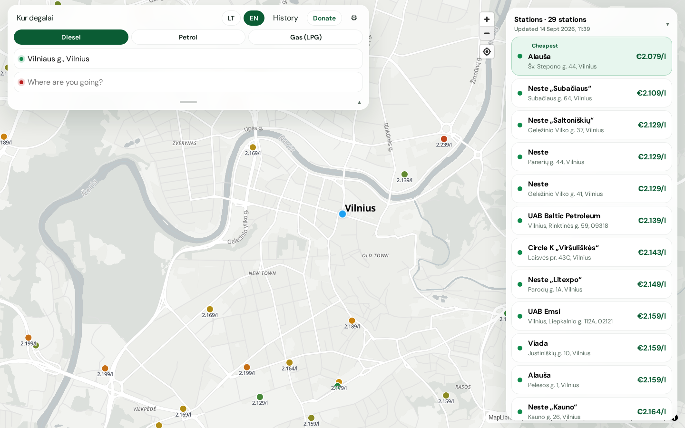
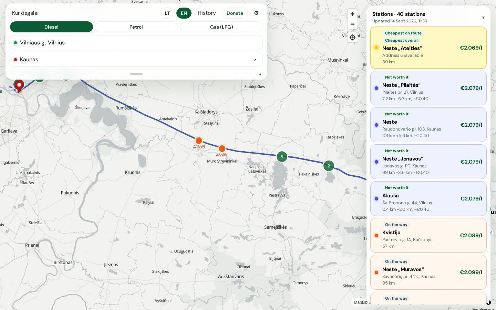
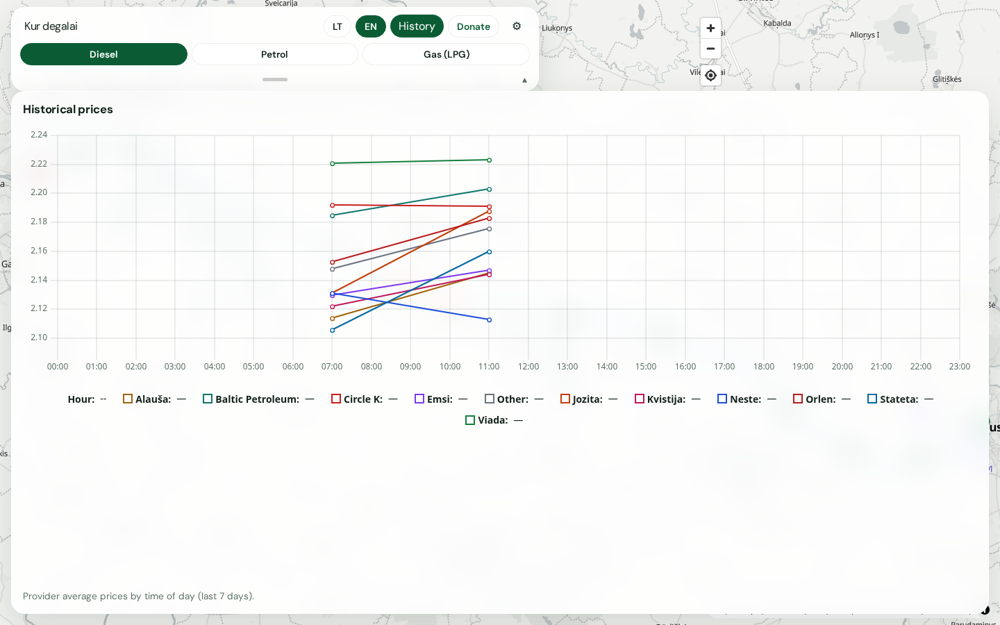
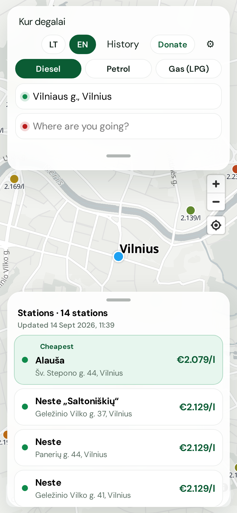

# Kur degalai

Free, up-to-date fuel prices at every station in Lithuania. Open the map, pick
diesel, petrol, LPG or EV, and see who is cheapest nearby or on the way.

**[Open the app](https://almantask.github.io/Degalai-web/)** · Lithuanian is the
default (`/`) · [English](https://almantask.github.io/Degalai-web/en/)

It is a static PWA: no account, no backend. Prices come from the Lithuanian
Energy Agency; station locations come from OpenStreetMap.

## Screenshots

Map of stations, coloured by price. The list is cheapest-first for the fuel you
selected.



Set a start (your location, an address, or a tap on the map) and a destination.
When there is more than one way there, pick one of up to three routes first.
Only the five cheapest stations on the way stay on the map, each with a dashed
route through it, plus the cheapest station on each dashed route when it beats
the one the line leads to. Stations off the route are hidden; tap another from
the list to add it.



**History** shows each brand’s average price over the last seven days, with
date and time on the timeline.



On a phone the search bar and station list are bottom sheets you can drag or
minimise for a full map.



## What you can do

- Browse every station in Lithuania on a MapLibre map (OpenFreeMap tiles).
- Filter **Diesel**, **Petrol** (95), **Gas (LPG)** or **EV**. Pins and the list
  follow that fuel.
- **EV** shows public charging points from the national charge point register
  (Via Lietuva) and OpenStreetMap with a €/kWh price where one is known, plus
  sockets with their power and any session fee in the popup. Chargers without a price
  still show (grey pin, listed last). A free charger has a "?" that says why it is
  probably free (see [provider-mistakes.md](provider-mistakes.md)).
  Under the EV chip, **Any power · 50+ kW · 150+ kW** keeps only chargers with a plug
  that powerful (kept in the link as `?fuel=ev&kw=50`). **My car's plugs** in Settings
  (Type 2, CCS, CHAdeMO, other) hides chargers your car cannot use. Both check each
  plug on its own, so a site with a 22 kW Type 2 and a 150 kW CCS is not a fast Type 2.
  With either on, a site the register prices for AC and DC apart shows and ranks by the
  price of the plugs that fit: DC for a fast search, not its cheaper AC price.
  Chargers of unknown power are hidden by a power filter.
  `chargers.json` loads only when you pick EV. On **History**, EV has the same
  average / min / max / median tabs per charging network (free chargers left
  out), plus a **Spot** tab with the hourly Nord Pool LT price, including
  tomorrow once it is published, and the cheapest upcoming hours.
- Scan a cheapest-first list of stations in view, with cheapest / most expensive
  badges and a last-checked time.
- Plan a trip: start defaults to your location; type a destination (Photon,
  Lithuania only). Pick one of up to three routes (in the list or on the map;
  switch later from the list). The map fits the route, hides off-route
  stations, and draws via-paths through the five cheapest stops.
- Make the route pass a point: under From / To, tap **Add point**, then tap the
  map. The route, and every dashed route through a station, goes through it.
  **Move point** places it again; **×** removes it and brings back the route choice.
- Tap a station for name, brand, address, and 95 / diesel / LPG prices. Search
  and the list collapse so the map can fit the route or the pin.
- Open **History** (`/istorija`, `/en/history`) for provider averages over the
  last seven days. That file loads only when you open the page, so the map stays
  light.
- Switch LT / EN in the header. **Donate** goes to
  [almantask.github.io/donate-me](https://almantask.github.io/donate-me/).
- Install it as a PWA. Offline, the last known prices still show.
- Send **feedback** (the speech-bubble icon in the header): report a bug or make a
  suggestion without a GitHub account, with a picture if you like. It becomes a public
  GitHub issue (your email stays private), and the form links to it; see
  [Feedback](#feedback).

Settings store consumption (l/100 km) and value of time. Ranking on the map and
on a route is still by pump price.

## Data

Data is built with the site, not committed. Every hour a Cloudflare Worker cron
(`worker/`) dispatches the **Hourly data + deploy** workflow, which restores the
previous pipeline state from the GitHub Actions cache, runs `npm run pipeline`
(keeping at most **7 days** of daily snapshots), and deploys `dist/` with the
fresh JSON under `data/`. The site stays static and fetches those files from its
own origin.

The `data/` files in git are only a seed: the workflow falls back to them (and
backfills from the LEA workbook) if the cache has been evicted.

The map loads `stations.json`, `meta.json`, and **today’s** price file only.
`history.json` is fetched when History opens. The published build does not ship
older daily files.

| Path                             | What                                       |
| -------------------------------- | ------------------------------------------ |
| `data/stations.json`             | OSM stations + unmatched LEA sites         |
| `data/chargers.json`             | OSM public EV chargers                     |
| `data/prices/YYYY-MM-DD.json`    | Daily snapshot (kept 7 days)               |
| `data/history.json`              | Provider averages by date and time         |
| `data/overrides/stations.json`   | Manual OSM ↔ source matches                |
| `data/overrides/prices.json`     | Optional 24 h user-report overlay          |
| `data/overrides/ev-tariffs.json` | EV network AC/DC tariffs (maintained)      |
| `data/cache/spot.json`           | Nord Pool LT hourly spot (unpublished)     |
| `data/cache/via-lietuva.json`    | Last good charge point register            |
| `data/cache/osm-chargers.json`   | Last good OSM charger list                 |
| `data/cache/source-health.json`  | 7 days of hourly source runs (unpublished) |
| `reports/unmatched.json`         | Source rows that still need a home         |

### Price sources

Every hourly run fetches all sources in parallel (`scripts/sources.ts`). A source
that throws, times out (180 s) or is skipped is logged as a failed run; it never
fails the build.

| Source     | Adapter                        | What it covers                                                                                                                                                                                                                                   | Fresh for |
| ---------- | ------------------------------ | ------------------------------------------------------------------------------------------------------------------------------------------------------------------------------------------------------------------------------------------------ | --------- |
| `lea-live` | `scripts/adapters/lea-live.ts` | Intra-day submissions behind LEA’s public map at [degalukainos.ena.lt](https://degalukainos.ena.lt/), ~750 stations. The pipeline reads `apiBase` and a public read token from that SPA (the token is not committed).                            | 36 h      |
| `lea`      | `scripts/adapters/lea.ts`      | Working-day **10:00** Europe/Vilnius workbook from [ena.lt](https://www.ena.lt/dk-pr-pr-duomenys/). Lagged, but also the backfill source.                                                                                                        | 36 h      |
| `circle-k` | `scripts/adapters/circle-k.ts` | [circlek.lt price page](https://www.circlek.lt/privatiems/degalu-kainos): the network-lowest 95, 98, diesel and LPG price, each with its station. Independent of LEA and the only source of a Circle K 98 price. Stamped 00:00 of the page date. | 36 h      |

**Hourly reliability.** Each run scores a source 1 (fetched at least its minimum
rows), 0.5 (fetched, too few rows) or 0 (failed). Reliability is the average over
the last 7 days, smoothed with 24 pseudo-runs of a seed score (`lea-live` 0.95,
`lea` 0.90, `circle-k` 0.70) so a cold cache or one bad hour does not reorder
anything. Sources stay in seed order unless one is more than 0.05 ahead of the
source above it. Freshness does not lower the score (LEA publishes nothing at
weekends); it is checked per price instead. A source that is down has no rows, so
the next one fills in that same hour; the ranking decides between sources that
both have a fresh price. With a full week of runs, `lea-live` drops below `lea`
after about 11 failed hours in 7 days.

**Which price is published**, per station and fuel (`pickPrice` in
`scripts/validate.ts`):

1. Among sources whose price is still fresh, the highest-ranked source wins.
2. If none is fresh, the newest Vilnius day wins, then the higher-ranked source.
3. A **user report** (`scripts/adapters/reports.ts`, optional JSON in
   `data/overrides/prices.json`, bound by OSM `stationId` or address, ignored after
   `expiresAt` or 24 hours) replaces that price unless the winner was observed
   later. Open a
   [wrong-price issue](https://github.com/Almantask/Degalai-web/issues/new?template=wrong-price.yml);
   a maintainer copies a fresh report into that file. GitHub Actions cache
   restores `data/`, then checks out this folder from git so committed reports
   apply.
4. With nothing new, the previous snapshot’s price is carried forward as stale.

`meta.json` lists the sources behind the published prices (`sources`) and this
run’s ranking with scores and prices chosen (`sourceRanking`). Failed sources show
as `::warning::` lines in the Actions run. Rehearse a fallback locally with
`PIPELINE_SKIP_SOURCES=lea-live npm run pipeline`.

Sources checked and not used (September 2026): degalu-kaina.lt, degalukaina.lt,
akcijukas.lt, kurokainoszemelapis.lt, degalukainos24.lt, piguskuras.lt and
xydata.lt all rehost LEA data. Neste, Viada, Baltic Petroleum, Emsi and Jozita
publish no per-station pump prices, orlen.lt did not respond, and Circle K’s
station locator has metadata only.

### EV chargers and the spot price

- **Chargers** (`scripts/chargers.ts`): every site in the national charge point
  register (below) first. OSM `amenity=charging_station` fills in places the
  register lacks; an OSM charger within 100 m of a register site is the same place
  and is dropped (its `charge` tag stays as a fallback price). OSM refreshes weekly
  and the register hourly. Private, customer-only, heavy-vehicle-only and
  bicycle-only points are skipped. A failed fetch never fails the build.
- **Charger price**, per charger, from the most trustworthy source that has one
  (`EV_SOURCE_ORDER` in `scripts/adapters/ev-tariffs.ts`):

  | Rank | Source        | What it is                                                                                                                                                                                                                                                                                                                                                                                                                                                                                 |
  | ---- | ------------- | ------------------------------------------------------------------------------------------------------------------------------------------------------------------------------------------------------------------------------------------------------------------------------------------------------------------------------------------------------------------------------------------------------------------------------------------------------------------------------------------ |
  | 1    | `via-lietuva` | [Via Lietuva's register of public charge points](https://ev.vialietuva.lt/en/data-provision), Lithuania's AFIR national access point: operators report each charge point and its ad hoc price. `scripts/adapters/via-lietuva.ts` reads the latest XLSX report (`/report/<id>`) every run, groups charge points into sites, and keeps the cheapest €/kWh (AC and DC shown in the popup, plus any session fee; "Nemokama" is free). A failed download uses the last report for up to 7 days. |
  | 2    | `ev-tariff`   | A network's AC/DC list price from `data/overrides/ev-tariffs.json`, copied by a maintainer from the network's page. DC applies to 50 kW+ or CCS/CHAdeMO chargers.                                                                                                                                                                                                                                                                                                                          |
  | 3    | `osm-charge`  | A volunteer's OSM `charge` tag, e.g. `0.39 EUR/kWh`.                                                                                                                                                                                                                                                                                                                                                                                                                                       |

  Tariff file format (values are illustrative):

  ```json
  [
    {
      "network": "Ignitis ON",
      "ac": 0.29,
      "dc": 0.39,
      "observedAt": "2026-10-06T00:00:00Z",
      "url": "https://…"
    }
  ]
  ```

  `network` is matched like OSM `network` / `operator` (`src/brands.ts`).

- **Spot price** (`scripts/adapters/nordpool.ts`): Nord Pool LT day-ahead prices
  from [Elering's public API](https://dashboard.elering.ee/) (no key), averaged to
  hours and stored as `byFuel.EV` in `history.json`. It is the exchange price
  without VAT, grid fees or supplier margin. A failed fetch keeps the cached hours.

Coordinates: OpenStreetMap. Attribute OSM, LEA, Circle K, Nord Pool / Elering, Via
Lietuva and the station chains. The charge point register is published under
[CC BY 4.0](https://creativecommons.org/licenses/by/4.0/) / ODC-BY; this app
groups its charge points into sites and shows the cheapest price per site.

## Feedback

The header's **Atsiliepimai / Feedback** icon opens a short form. The visitor first
picks **Klaida / Bug** (red) or **Pasiūlymas / Suggestion** (green), writes the text
and gives an email address. It posts to `POST /report` on the cron worker
(`worker/src/report.ts`, `https://kur-degalai-cron.almantusk.workers.dev`), which
files the GitHub issue itself with the maintainer's token; the visitor never leaves
the site and needs no GitHub account. A bug is labelled `bug` and `user-report` (title
`[bug] …`), a suggestion `enhancement` and `user-report` (title `[feature] …`). The
issue also lists the page, language, fuel, data time, browser and screen size. Visitor
text sits in code blocks, so it cannot @mention anyone or reference other
repositories. While the worker files the issue, the form shows a spinner and says the
link comes within a minute; then it shows the issue's number, a button to open it and
its address with a copy button. With no answer after a minute it stops waiting, says
the message was most likely filed and links to the latest reports, keeping the draft
in case it was not. Closing the form while it waits loses nothing: reopening shows
the outcome.

**Email.** Required, and checked in the browser and by the worker
(something@somewhere.tld). Issues are public, so the address never goes into one: the
worker keeps it for a year in the `REPORT_CONTACTS` KV namespace under a random key,
and the issue's **Contact** section names that key. To reply, open the Cloudflare
dashboard → **Storage & Databases → KV → kur-degalai-report-contacts** and look up the
key.

**Pictures.** The visitor can attach a picture or paste a screenshot (Ctrl+V). The
browser redraws it as WebP (JPEG where WebP cannot be written), at most 1600 px on
the longer side and 1.5 MB; redrawing also drops EXIF data such as a phone photo's GPS
position. The worker accepts only PNG, JPEG or WebP whose bytes match the type, stores
it in the `REPORT_IMAGES` KV namespace for a year, and shows it in the issue from
`GET /report/image/<id>.<ext>` on the worker. To take a picture down early, delete its
key in **kur-degalai-report-images**.

If KV cannot store a picture or an address (for example the free plan's 1,000 KV
writes a day are used up), the issue is still filed and says what is missing. The
worker only takes posts from `REPORT_ORIGINS` (`worker/wrangler.jsonc`), allows 3
reports a minute per IP and 10 a minute in total (Workers rate limiting), and quietly
drops forms whose hidden honeypot field is filled in.

The worker's `GITHUB_TOKEN` (from the `WORKFLOW_DISPATCH_TOKEN` secret) needs
**Issues: Read and write** on this repository besides **Actions: Read and write**; a
classic token with `repo` scope has both. To try the form against a local
`wrangler dev`, build the site with `VITE_REPORT_URL=http://127.0.0.1:8787/report` and
add the dev origin to `REPORT_ORIGINS`.

## Routing

Geocoding is Photon, clipped to Lithuania. Routing uses OpenRouteService when
`VITE_ORS_KEY` is set (shortest preference, one route), otherwise the public
OSRM demo (fastest, plus up to two alternatives). The hourly build takes the key
from the `ORS_KEY` repository secret; it ends up in the public JS bundle, so
visitors share its daily quota, and routes fall back to OSRM once it is used up.
Detours fall back to haversine × a road factor when a via-route is unavailable.

A station is **on the way** when stopping there adds less road to the route you
picked than your limit (Settings → Largest detour, 1 km by default, 0.1–4 km):
leave the route 1 km before the station, stop, and rejoin it 1 km after, against
driving straight through. Every priced station within
2 km of the route line (up to 120, closest first) gets that detour from one OSRM
`table` request per 30 stations. The route points keep the route's heading
(`bearings`) and the station must be reached on the driver's side of the road
(`approaches=curb`), so a station across the road or behind a hill drops out even
when it is close to the line, and one just off the route stays in. The list
shows that detour ("detour +0.8 km"). If the table request fails, stations within
500 m of the line count as on the way.

On each dashed via-route, the cheapest station within 200 m of it is marked too
("Cheapest on the dashed route") when it is cheaper than the station the line
leads to and within your detour limit of that line by road (same check). Its
detour is the dashed route's extra length plus that stop.

## Develop

```bash
npm install
npm run pipeline          # OSM + LEA live + LEA Excel + Circle K + reports + EV (needs network)
npm run dev
```

```bash
npm run check             # i18n keys, lint, unit tests, types
npm run build
npm run test:e2e
npm run test:deps         # dependency tests (needs network)
```

**CI** (`ci.yml`) runs `check` on every pull request and push to `main`. Run it on
any branch from Actions → CI → Run workflow (`gh workflow run ci.yml --ref <branch>`);
a run started that way also runs the Playwright tests. Claude Code sessions check
changes this way rather than locally (`.claude/skills/ci-checks/SKILL.md`).

**Dependency tests** (`tests/deps/`) check that everything needed to call each
outside service is there. `wiring` is offline and runs in CI: every `env` name the
cron worker reads is set in `wrangler.jsonc` or as a secret by `worker.yml`, the
dispatched workflow accepts `workflow_dispatch` and deploys from that ref, the
worker serves the `REPORT_ENDPOINT` the site posts feedback to, the build passes
every `VITE_` variable the deployed site needs, the committed overrides load
without dropping entries, and every Actions secret and variable is handed to the
dependency tests. The rest call the real services through the app's own code:
LEA's map bundle still holds the API address and token, the ena.lt page still
links the workbook, Circle K, Via Lietuva, Elering, Overpass, Photon, OSRM and
OpenFreeMap still answer the way the code reads them, the worker takes a report
from the site's origin (honeypot field filled, so nothing is filed), and GitHub
has the branch, enabled workflow and labels.

`credentials` uses each secret through the code that uses it:
`WORKFLOW_DISPATCH_TOKEN` with the worker's dispatch and issue calls (sent so
GitHub refuses them after accepting the token: nothing starts, nothing is filed),
`CLOUDFLARE_API_TOKEN` / `CLOUDFLARE_ACCOUNT_ID` with wrangler (the KV namespaces
and the deployed worker's secrets) and `ORS_KEY` with `fetchRoute`. The
**Dependencies** workflow runs everything daily and on pushes that change how a
service is called; there an empty secret fails (`ORS_KEY` is optional). Locally a
test skips when its value is not in the environment.

To refresh the README shots (preview must be running on port 4173):

```bash
npm run build && npx vite preview --host 127.0.0.1 --port 4173
npx tsx scripts/capture-screenshots.ts
```

## Licence

Apache-2.0. Map and station data remain under their upstream licences (ODbL for
OSM).
